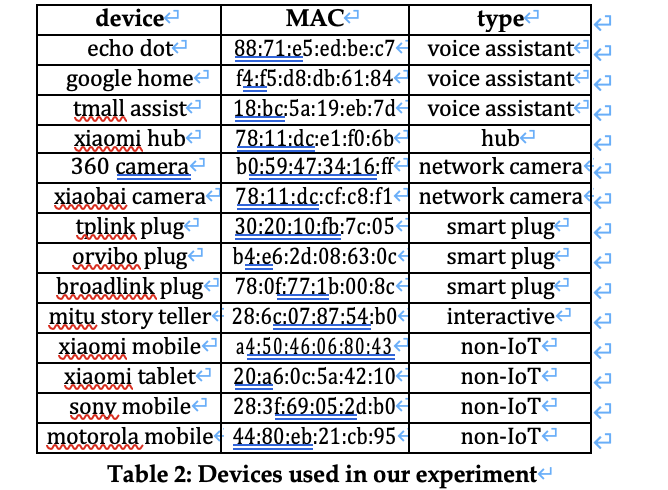
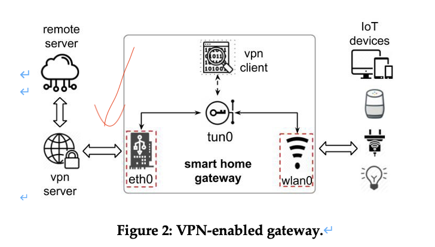
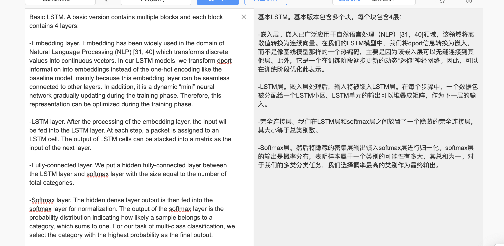
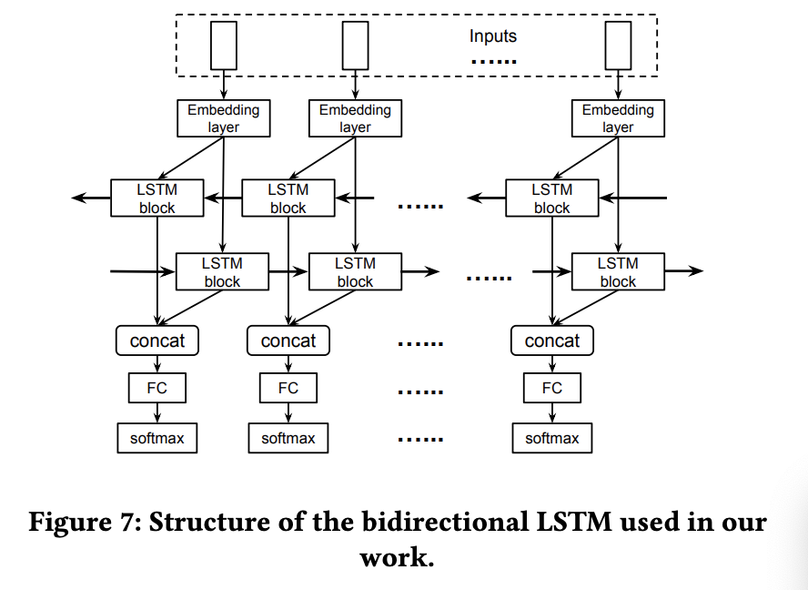
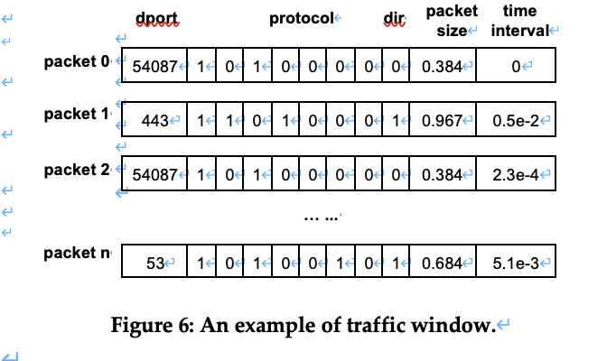
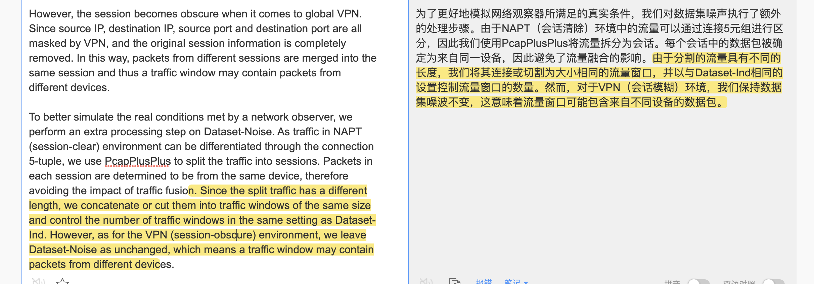

https://baijiahao.baidu.com/s?id=1646896790798085286&wfr=spider&for=pc

#  摘要

通过利用单个设备的数据包之间的时间关系，可以可靠地识别设备，基于序列学习技术（如LSTM）的流量分析框架，并利用数据包之间的时间关系进行设备识别,实现以高精度区分设备类型

```
we found such temporal relations can be modeled by sequence model LSTM-RNN when grouping consecutive packets into a traffic window.
```

补充：

NAPT:如果NAT只进行IP地址的简单替换，就会产生一个问题：当有多个内部主机同时去访问同一个服务器时，从返回的信息不足以区分响应应该转发到哪个内部主机，NAPT与NAT不同，它将内部连接映射到外部网络中的一个单独的IP地址上，同时在该地址上加上一个由NAT设备选定的TCP 端口号。[(91条消息) NAT、Napt（地址转换技术）详解_GR90的博客-CSDN博客_napt](https://blog.csdn.net/qq_33727884/article/details/106919268)

VPN：当客户机通过VPN连接与目标计算机进行通信时，先由NSP(网络服务提供商)将所有的数据传送到VPN服务器，由VPN服务器将所有的数据传送到目标计算机。[VPN 原理以及实现 (seebug.org)](https://paper.seebug.org/1648/)

# 简介

更具体地说，我们发现，当将连续数据包分组到流量窗口中时，这种时间关系可以用序列模型LSTM-RNN建模。我们仔细设计了这两个模型的结构，并在两个数据集上进行了评估，这些数据集充满了从现成物联网设备和非物联网设备生成的流量。评估结果表明，与现有的Random FREST等广泛使用的模型相比，我们的模型可以获得更好的精度。值得一提的是，我们的双向LSTM模型可以在NAPT和VPN配置的物联网设备上实现99.2%和97.7%的准确率。即使同时产生大量非物联网流量，在这两种配置中仍可以达到95.3%和80.9%的准确率。

贡献：

（1） 我们提供了一个流量分析系统HomeMole，可以自动推断智能家居网络背后的物联网设备，即使启用了NAPT和VPN等流量融合。我们设计了一个基本的LSTM模型和一个双向LSTM模型，能够根据嗅探到的数据包识别物联网设备。

（2） 我们在两种网络配置（NAPT和VPN）和两种场景（纯物联网和噪声环境）下评估了我们的系统。结果表明，在这些条件下，我们的框架可以达到较高的精度。由于能够建模数据包之间的时间关系，我们的模型优于基线模型随机森林。

发布了数据集和源代码：

https://drive.google.com/drive/folders/1aQXlBKZaal8MgsrYx2hyanorwMZEKv6e

# 背景

## 智能家居网络环境

智能家居内的网络通信涉及四方：物联网设备、服务提供商、网关和用户

物联网设备分为两种：普通IoT设备和IoT hub

许多设备供应商已将其服务转移到云上

## IoT流量探索性分析

- 属于同一类别的设备具有相似的通信模式。作为一个例子，我们在附录的图16和图17中显示了亚马逊Echo Dot和谷歌语音助手（都是语音助手）在被唤醒时的流量模式。可以看出，当语音命令被识别时，它们都会生成流量突发，然后与远程服务器进行一段时间的连续通信。

- 处于不同运行状态的相同设备可能具有显著不同的流量模式。从附录的图18中可以看出，Orvibo交换机在待机模式下产生的流量较运行模式下的流量密集，但数量较少。

- 协议的选择。对于流量较大的设备，如网络摄像头，通常采用UDP。与非物联网设备相比，物联网设备产生的通信HTTP流量要少得多。虽然**以前的工作通常使用DNS进行设备识别[11、12、37]**，但我们的结果表明，与其他协议相比，DNS的比率非常低。

## NAPT和VPN

NAPT修改网络层和传输层标识符，如入站数据包的目标IP地址和目标端口号；对于出站数据包，将转换源IP地址和源端口。在这两种情况下，本地设备的IP地址都将替换为网关的IP地址。使用NAPT的网关拥有一个转换表，该表记录地址和端口的映射，以便将入站数据包路由到正确的目的地。

VPN：对于从wlan0到eth0的每个数据包，VPN客户端首先将原始数据包加密为有效负载，并构造一个新数据包。然后新数据包被传送到VPN服务器（而不是原来的目的服务器）并被解密。VPN服务器然后将复原的数据包转发到其原始目的地。从目标远程服务器的角度来看，源IP地址和源端口等原始数据被完全隐藏。

## **Adversary Model**

识别智能家居中的设备类型不仅可以泄漏敏感信息，如用户对物联网产品的偏好，还可以作为进一步推断的基础，如用户行为检测（代表工作：NDSS2020）。这种隐私泄露会给用户的日常生活带来负面影响。例如，ISP可以推断设备信息并将其出售给喜欢做有针对性广告的广告商。或者，小偷可以通过嗅探出站流量并推断安装的监控摄像头的状态来选择用户不在家的时间。在这项工作中，我们考虑被动窃听者，他们可以观察网关和远程服务之间的加密网络流量。更重要的是，有两个现实的设置是以前的作品没有考虑的。一方面，我们假设网关中启用了NAPTs或VPN，以便**用网关的标识符替换原始设备标识符，并合并属于不同设备的流量**；

另一方面，我们假设多个设备（包括物联网设备和非物联网设备，如手机和平板电脑）可以同时工作，从而使其数据包交错。如【37】所示，非物联网设备通常具有更高的数据包生成速率，且其容量大于物联网设备，这意味着非物联网设备的存在可能会显著扭曲物联网设备上学习到的原始统计特征。

**之前的工作【9、12、41】假设对手可以嗅探智能家庭网络（即本地对手）内的流量，或者网关不执行流量融合**。在他们的场景中，来自不同设备的流根据设备标识符被清楚地分开。与之前的工作不同，我们研究中的远程对手更现实，流量分析更具挑战性。

# 正文

## 简介

HomeMole的目标是根据智能家居环境中的网络流量识别活动物联网设备。为此，HomeMole采取了三个步骤——流量收集、流量预处理和流量识别。如图4所示，我们首先设置智能家居环境，收集不同设置下物联网设备和非物联网设备产生的原始流量。之后，HomeMole对流量进行预处理，并将其转换为其标识模块可以识别的形式。最后，识别模块使用预处理的数据来训练模型并执行设备识别任务。

与那些在流级别进行指纹识别的人不同【17，41】，HomeMole在**数据包级别**工作，这意味着在我们的模型**处理完所有数据包后，会给它们一个标签**。因此，HomeMole能够在联机模式下工作，并给出当前设备状态的提示结果。除此之外，数据包级标识可以很容易地应用于具有任何其他粒度的任务。

## 流量采集

我们在校园实验室中设置了15个设备，包括10个物联网设备和4个非物联网设备。表2显示了我们设备的详细信息。这些设备具有不同的交互模式和流量模式




### 三种环境

单设备环境；多设备和噪音环境；VPN环境

### 流量触发方式

自动：由移动应用程序控制的智能插头和网络摄像头等设备；手动：用于从多设备场景收集流量，随机性，有助于我们的模型的泛化。

请注意，由于NAPT和VPN修改了数据包的标识符，在wlan0收集的原始流量与攻击者获得的流量之间存在差异。

### 流量采集地点

我们采用流行的网络分析工具tshark同时监控wlan0和eth0。收集的流量被转储到扩展名为“.pcapng”的文件中，然后在分类之前进行预处理。

收集了4.05 GB的流量和7223282个数据包（不包括我们的模型无法获得的数据包，就像只在局域网内传输的数据包一样）。

由于设备的不同功能和用户的不同习惯，收集的流量不符合统一分布。请注意，由于NAPT和VPN修改了数据包的标识符，在wlan0收集的原始流量与攻击者获得的流量之间**存在差异**。为了模拟真实的对手场景，我们**随后对流量进行预处理**，如第3.3节所示。

## *流量预处理

### 特征提取

物理层：frame length ； epoch time

传输层：目标端口号

用二进制向量表示packet的数据类型：选择了6种最常见的协议类型，包括IP、TCP、UDP、TLS/SSL、HTTP和DNS。如果数据包涉及其中一个协议，则相应的位将设置为1，否则为0。对于前6个协议之外的协议，我们将“二进制字符串”的最后位置设置为其他位置。例如，基于UDP的DNS请求表示为<1010010>，NTP数据包表示为<1010001>。

Packet的方向：我们将0和1分别用于入站和出站数据包

```
We select features from different layers – frame length and epoch time from physical layer, and destination port number from transport layer.

In addition, we use a binary sequence to represent the protocols in packet transmission. We select 6 most common protocol types including IP, TCP, UDP, TLS/SSL, HTTP and DNS

The only feature we consider beyond metadata is the direction of the packet. We use 0 and 1 for inbound and outbound packets respectively.

```

**没有选择某些特征的原因：**请注意，由于两个原因，我们在DNS请求/响应中**没有像之前的工作【11，12】那样使用域名**，首先，在VPN或DNS加密下，明文DNS信息不可用（例如，TLS上的DNS和HTTPS上的DNS），其次，正如我们的评估结果所示，即使没有DNS信息，HomeMole也可以实现良好的准确性；未使用目标IP，因为当物联网供应商在公共云上运行远程服务器时，目标IP会定期更改，这已成为一种流行的选择。

请注意，我们**从两个相邻数据包之间的epoch time计算时间间隔**，并将其用作建模数据包之间时间关系的特征。

最后，我们将所有选定的**11个特征**串联起来，组成一个一维向量，作为数据包的表示。请注意，我们从两个相邻数据包之间的epoch time计算时间间隔，并将其用作建模数据包之间时间关系的特征。

```
In the end, we concatenate all the selected 11 features and compose a one-dimensional vector as the representation of a packet<dport, protocols, direction, frame length, time interval>
```

### 给数据包打上标签

在将每个数据包转换为具有**11个特征的向量**后，我们对它们进行标记，以便于识别模块的训练和评估。

**对于NAPT环境：**由于**NAPT下的收集是在wlan0上完成的**，因此MAC地址的原始信息得到了很好的保留，我们提取每个数据包的源MAC地址和目标MAC地址，将它们与设备的MAC地址进行比较，并确定该数据包的标签及其方向（入站或出站）。请注意，MAC地址仅用于数据包标记。我们的对手模型的物理位置决定了他/她无法利用原始数据包的MAC地址，因为它们已被NAPT伪装。

**对于VPN环境：**如第2.4节所示，**在智能家居的外部（或eth0和VPN服务器之间）**收集的数据包全部合并到一个流中（具有相同目标IP和目标端口的数据包【41】），没有任何发送方/接收方的原始标识符。为了识别VPN数据包并用相应的设备的类型来标记这些数据包，我们开发了一种映射技术，该技术基于我们通过实证分析获得的三个观察结果：（1）经过VPN处理后，数据包的大小增加；（2） VPN加密后，多个大小不同的数据包可以具有相同的大小；（3） VPN导致的数据包传输延迟通常小于0.02秒。



根据VPN加密之后的数据包（VPN-processed packet）反推加密之前的数据包：对于每个时间戳为t的VPN处理包，我们首先检查其方向。如果它是**入站**的，我们在时间窗口{t，t+0.02}中搜索具有**较小**数据包大小的对应项。如果是**出**站，则时间窗口变为{t-0.02，t}。为了评估这种配对方法的有效性，我们部署了一个启用VPN的网关，只有一个设备连接到它，并同时收集到达（wlan0）和离开(eth0)网关的数据包。然后，我们将配对方法应用于所有数据包，以获得数据包对并测量正确数据包对的速率。总体精度达到98.8%。


*思考：为啥NAPT环境采集wlan0处的数据包即可，而VPN环境必须采集VPN加密之后的eth0口采集。那是因为NAPT只改变原始数据包的源ip和源端口，为方便给数据包打标签，我采集NAPT之前的数据包，只要特征里没有用到源ip和源端口即可；而VPN加密的过程复杂，我的模型针对的是VPN-processed packet，所以必须采集VPN后的流量，然后想办法把VPN客户程序加密之后的数据包和之前的数据包一一对应。*


## *流量识别/分类

### baseline model

将随机林作为我们的基线模型，用有标记的数据包的特征向量训练一个随机森林模型，dport在**被基线模型**使用之前需要进行处理，首先将dport值编码为一个one-hot二进制字符串。由于大多数端口很少使用，我们使用主成分分析（PCA）将字符串减少为50个主成分。

### 基于序列的模型

**Basic LSTM**

Embedding->LSTM->FC->softmax



**Bidirectional LSTM**



# 评估

实验结果表明数据包之间的依赖性确实揭示了每个IoT设备的类型特有的模式

### 场景：

（Pure场景（只有一个活动的IoT设备），noisy场景（多个活动的IoT设备+非IoT设备））*（NAPT配置，VPN配置）

### 流量窗口**Traffic window**

经过预处理后，每个数据包被转换为一个特征向量。为了便于基于序列的模型的训练和测试，我们将每n个连续向量分组以形成一个流量窗口,论文中n=100



### 数据集

为两个场景构建了两个数据集，每个数据集都有一个NAPT版本和一个VPN版本

Dataset-Ind：数据集被组织成流量窗口集合，每个流量窗口仅包含来自某个特定设备的数据包。为了使数据集更加平衡，我们为每个设备设置了5000 个windows的最大阈值（事实上NAPTed的数据集也是这样）

Dataset-Noise：用于生成此数据集的流量来自多个活动物联网和非物联网设备。因此，此数据集中的流量窗口由来自多个设备的数据包组成。图8显示了流量窗口中设备组合的分布，从中我们可以看出，一个流量窗口中包含2个设备或3个设备的组合是最常见的。

### 指标

由于HomeMole能够对单个数据包进行分类，因此我们根据每个数据包正确识别设备的概率来衡量HomeMole的有效性：数据包分类准确率、设备分类准确率。

### Pure-IoT环境

#### 基线模型

#### LSTM模型

### Noisy-IoT环境

该环境下数据集分析：

#### NAPT情况下：

session-clear 情况，即NAPT环境。NAPT环境下出站流量的原始源IP和入站流量的目标IP被路由器屏蔽。然而，在大多数情况下，**双方之间的每个连接都拥有一个不变的连接5元组sip、dip、sport、dport和协议【14】。同一元组下的数据包与同一TCP/UDP会话相关联，自然来自/前往同一设备。**

也就是说NAPT下，一个设备发出的流依旧存在且可区分，只是源ip和端口号被隐藏。

#### VPN情况下：

当涉及到全局VPN时，会话变得模糊。由于源IP、目标IP、源端口和目标端口都被VPN屏蔽，**原始会话信息被完全删除**。以这种方式，来自不同会话的packet被合并到同一会话中，因此**同一流量窗口可以包含来自不同设备的packet**。

重要！！！综上：

由于NAPT（session-clear）环境中的流量**可以通过连接5元组进行区分**，因此我们使用PcapPlusPlus将流量拆分为会话。**每个会话中的数据包被确定为来自同一设备，因此避免了流量融合的影响。**由于分割的流量具有不同的长度，我们将其连接或切割为**大小相同的流量窗口（100），并以与Dataset-Ind相同的设置控制流量窗口的数量**。然而，对于VPN（会话模糊）环境，我们保持Noisy-IoT数据集不变，这意味着流量窗口可能包含来自不同设备的数据包。



**也就是说NAPT下的每个流里的数据包也来自同一个设备，这和Pure-IoT环境下采集的数据集一样。**只有在VPN环境下的一个流里的数据包才可能来自多个不同的设备。

#### 基线模型

#### 基于序列的模型

双向LSTM在NAPT和VPN中的准确率最高，分别为95.3%和80.9%。

结论：（1）LSTM-RNN模型能够很好地识别NAPT配置中的流量；（2） LSTM-RNN**在VPN配置中的性能要差得多**，尤其是在智能插头等物联网设备上（BLSTM：在5次交叉验证中，Orvibo为13.4%，Tplink为20.2%，Broadlink为14.9%）。（3） 非物联网流量对大多数物联网设备的识别有负面影响。


从论文4.4 Case Studies开始都是一些讨论内容，略

```
VPN可以有效防御设备识别的原因

包级别标签的好处

只使用UDP协议建立VPN连接。另一个选项–TCP（TLS）未测试。主要原因是UDP是openVPN服务采用的默认协议

之前的工作也探讨了用户行为识别[9]。我们没有对行为识别进行实验，因为考虑到我们有数百万物联网数据包的大型数据集，标记成本很高。另一方面，如果我们有足够的训练样本，我们相信我们的模型可以应用于这种情况。我们将探索有效生成标记行为数据集的方法。
```

