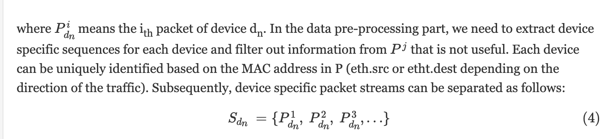
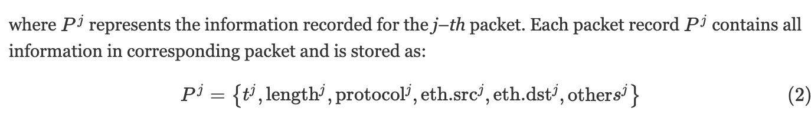
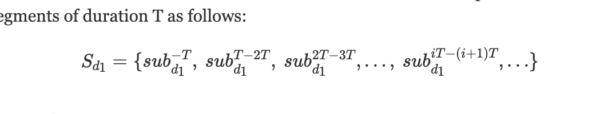
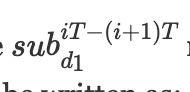
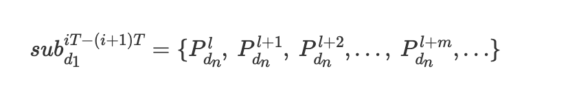
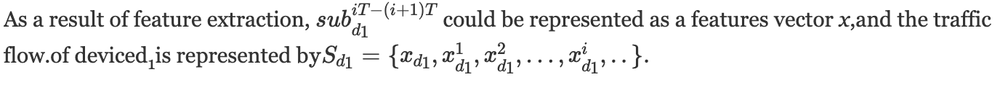
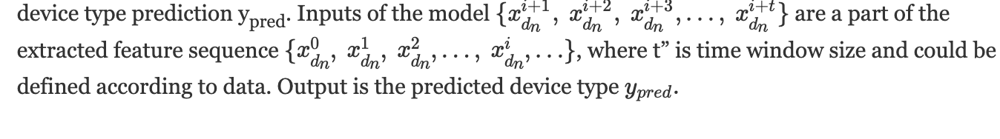
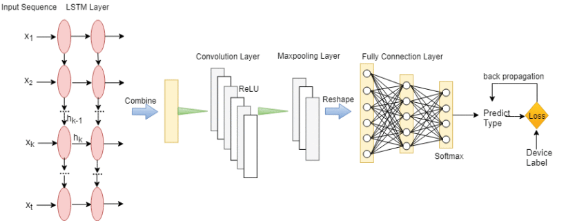

[根据物联网|的网络流量流自动对设备进行分类IEEE会议出版物|IEEE Xplore](https://ieeexplore.ieee.org/abstract/document/8638232)

# 简介

**特点：identify new and unseen device types**

通过分析物联网网络流量自动识别新的设备的（已知）类型，其中我们使用流量流来描述设备的语义类别。

我们提出了一个物联网设备自动分类的统一框架，其中我们设计了一种方法，用于提取设备之间的特征和不变依赖关系。特别是，我们对现实世界物联网流量数据的关键特征进行了深入的实证研究。我们还提出了一个**LSTM-CNN级联模型**，通过**有监督**的方式捕获全局和局部时间相关性，对物联网设备进行分类；

据我们所知，我们是第一个利用网络流量的时间依赖性，根据IoT设备的功能自动**将未知物联网设备在类型上进行分类**的公司。与现有工程相比，考虑到大量物联网设备，我们的方法将易于扩展以获得更好的实际使用。我们提出的模型可以在只需少量训练集的情况下，对新设备进行分类，从而达到令人满意的精度。我们还表明，我们的方法优于各种基线算法。

也就是说论文做的**并不是真正的开集识别**，而是：共4个**设备类型**标签，测试集里有设备di，但它不在训练集里，那么还能够将di分到这4个类别里。

# Segmentation

Sdn：设备dn的流

Pidn：设备dn的第i个数据包的信息记录（recorded for i-th packet）

- segment raw traffic flows：

  根据包的时间戳，以固定的时间间隔T，将一个设备的原始流分割成多个子流：

  

  期中

  

  表示设备d1在iT到(i+1)T的时间段内的所有记录:

  

  

# Feature Extraction

从每一个sub[dj,iT-(i+1)] 中提取特征，主要从：traffic volume, packet length, network protocols and direction of traffic (i.e. incoming vs outgoing)

定义前置概念：对每个数据包P进行分类，分成：用户包和控制包；传入包和传出包。

接下来对每个设备的Sdj所包含的每个sub[dj,iT-(i+1)] 提取如下特征：

- 数据包计数特征：总数据包数量、用户数据包、控制数据包、接收数据包、传输数据包以及不同协议（如DNS、ARP、NTP）的数据包计数；

- 包长特征：一阶和二阶统计特征，包括最大值、最小值、均值、和，标准差、方差、偏度和峰度（maximum, minimum, mean, sum, standard deviation, variance, skewness, and kurtosis），还有上述四种类型包的这些特征；
- 协议相关特征：sub[dj,iT-(i+1)] 中不同类型协议数据包的计数

特征提取的结果：一个sub[dj,iT-(i+1)T] 一个特征向量x，一个设备有一个时间间隔为T的特征向量组成的序列

# Device Classification

模型的输入：

LSTM层：输入首先被送入两个LSTM层，以捕获网络流量的时间关系

LSTM的输出是t个向量，将它们连接成列，形成一个二维向量，将这个二维向量送入卷积层，激活函数为ReLU，再送入maxpooling层，最后送入全连接层，softmax输出预测概率。

# 实验

## 数据集

UNSW-TMC 2018，但只选了其中一部分

**训练集**：we pick Amazon Echo from Hubs, Belkin Wemo Switch, TP-Link Smart Plug from Switches & Triggers, Pix photo frame from Electronics and Withing Smart Baby Monitor, Netatmo Welcome, and Samsung Smart Camera from Cameras, and use their data as the training data

**测试集**：来自其余设备的数据将用作测试数据

## 测试模型 识别未知设备到已知设备类型 的能力

若要测试对未知设备类型进行分类的性能，应从训练数据中排除此设备的流量流。我们选择每个类别中的设备进行训练，并使用该类别中的其余设备进行测试。更具体地说，我们从Hubs中选择Amazon Echo，从Switchs & Triggers中选择Belkin Wemo Switch，从Switchs & Triggers中选择TP-Link Smart Plug，从Electronics和Withing Smart Baby Monitor中选择Pix相框，Netatmo Welcome和Cameras选择Samsung Smart Camera，并使用他们的数据作为训练数据。来自其余设备的数据将用作测试数据。

## 实验参数

我们将分割时间间隔T设置为5分钟，并在将提取的特征输入分类模型之前对其进行规范化和洗牌。

在对不同的特征组合进行初步测试后，我们选择了6个最具辨别力的特征：用户包数、用户包长度平均值、用户包长度峰值、控制包数、控制包平均值、控制包峰值。

我们模型的时间窗口大小（如第3.3节所述）设置为6，连续窗口之间有50%的重叠（即，当时间窗口大小为6时，重叠为3）。

在卷积层，我们使用32个2*2滤波器，步幅为1*1。在maxplling层中，过滤器大小和步幅都是2*2。此外，我们的分类模型还有其他三个超参数：辍学概率、学习率和L2归一化系数。在超参数调整后，我们将其值分别设置为0.8、0.05和0.01。

hi品
