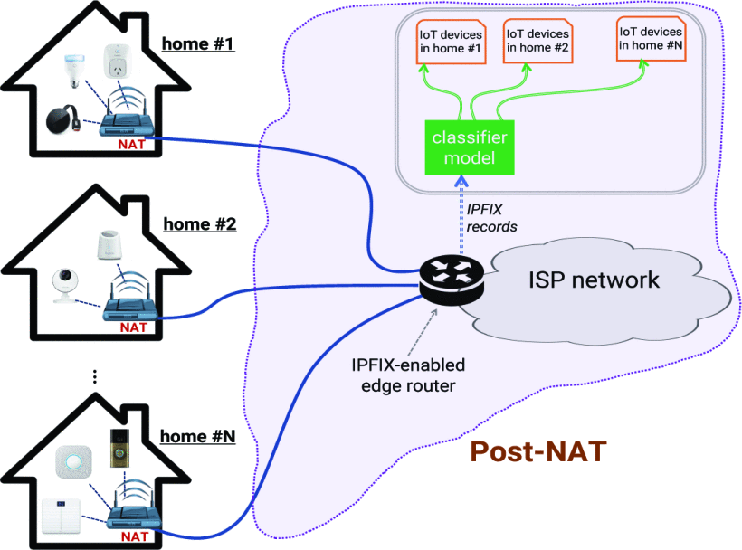
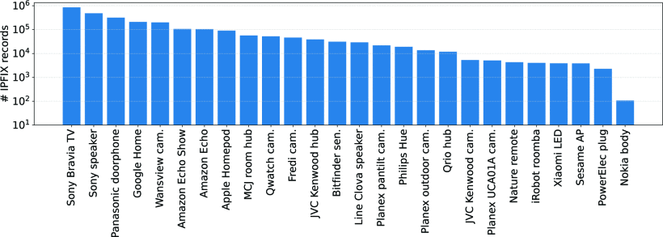
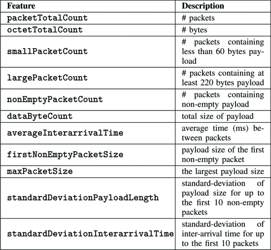
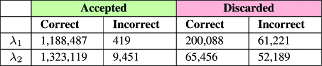
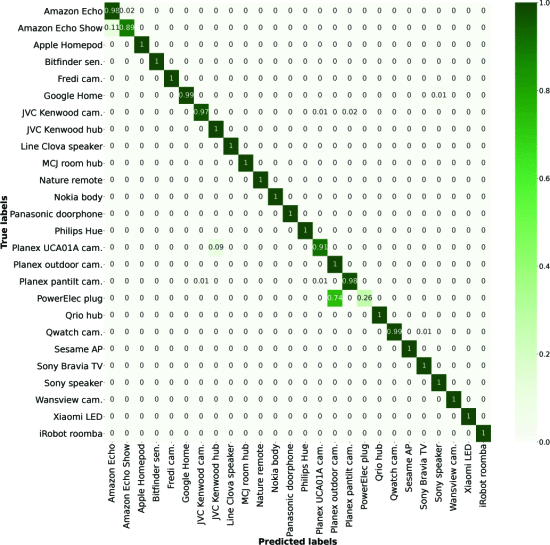

# 前言

论文地址：[Inferring Connected IoT Devices from IPFIX Records in Residential ISP Networks | IEEE Conference Publication | IEEE Xplore](https://ieeexplore.ieee.org/abstract/document/9524954)

团队简介：即UNMSW TMC2018的团队，该团队分析物联网设备的网络流量，评估其安全性和隐私状况，并开发模型来了解其行为，该团队19年以来较新的论文总结：

* 研究IoT行为的: TDSC 2020的["Verifying and Monitoring IoTs Network Behavior using MUD Profiles](https://www2.ee.unsw.edu.au/~hhabibi/pubs/jrnl/20TDSCmud.pdf)，IoT-J2020的 ["Detecting Behavioral Change of IoT Devices using Clustering-Based Network Traffic Modeling"](https://www2.ee.unsw.edu.au/~hhabibi/pubs/jrnl/20IoTJ_1Class.pdf)
 * IoT设备识别的：LCN2019的["Inferring IoT Device Types from Network Behavior Using Unsupervised Cluste ring"](http://www2.ee.unsw.edu.au/~hhabibi/pubs/conf/19lcn_iot.pdf)根据设备行为无监督聚类设备类型；
 * LCN2021的[Inferring Connected IoT Devices from IPFIX Records in Residential ISP Networks | IEEE Conference Publication | IEEE Xplore](https://ieeexplore.ieee.org/abstract/document/9524954)，对应的有一个三个月内测试平台中设备的本地和远程流的 IPFIX 记录的数据集
* 研究IoT安全的：ACM SOSR2019的”Detecting Volumetric Attacks on IoT Devices via SDN-Based Monitoring of MUD Activity“,对应的有一个包含良性和攻击流量的数据集
# 简介
三个工作：（1）分析了三个月内从住宅测试平台收集的26个物联网设备的近300万条IPFIX记录，并确定了28个特征，这些特征与其网络活动和服务相关，这些特征表征了物联网设备的网络行为;（2） 开发了一个多类分类器，从 NATed IPFIX 记录推断家庭网络中是否存在某些物联网设备类型，开发了一个信任指标，以跟踪一段时间内检测到的设备的网络活动；（3）我们通过将经过训练的分类器应用于IPFIX记录来评估推理方法的有效性，该跟踪在检测设备类型时平均准确率为96%。通过计算每个设备的信任度，我们（在测试平台上）突出显示了三分之一设备中的永久性行为变化以及其他设备中的一些间歇性行为变化。

与前人工作对比的创新点：1.在ISP上做的设备类型发现，这样不需要将模型部署到住宅网关设备上；2.对NAT之后的流量，做的是"是否存在某种类型的设备"；3.只针对IPFIX，它不会暴露用户私人信息，特别是没有用到与设备交互的云服务器等信息

# 从ISP的IPFIX记录推断设备类型
## 系统结构：

工作过程：来自家庭网络的流量被发送到 ISP 网络，其中启用了 IPFIX 的边缘路由器配置为导出相应的 IPFIX 记录。当流终止时，其 IPFIX 记录将显示到分类模型中，以确定其相应的设备类型，ISP将通过预测IPFIX流的设备标签，逐步为每个家庭附加物联网设备列表。

## 实验环境和数据集

26 个 IoT 设备上的 IPFIX 记录数

- 在 2020 年 1 月、3 月和 4 月期间从测试平台（NAT 前）收集了 PCAP ，需要注意的是，我们是在 NAT 之前收集的数据，以获取流量数据的ground truth标签（设备 MAC/IP 地址）;但是，我们不会在推理过程中利用任何设备标识（其MAC和/或IP地址），我们从 NAT 之前收集的原始数据中排除本地流，仅保留远程流以开发推理模型。

- 排除本地流的方法：我们的 IPFIX 数据集 包含超过 900 万条 IPFIX 记录，其中约 70% 是不会离开 NAT 网关的本地流（ISP 边缘路由器无法捕获）。我们使用 IPFIX 记录的 IPv4 地址来过滤本地流，包括：（i） 由互联网号码分配*机构 （IANA*） 保留的具有源和目标的单播流（即 10/8、172.16/12、192.168/16），[25]，（ii） 多播流（*即*地址在 224/4 范围内），（iii） 链路本地流（*即*地址在 169.254/16 范围内））和（iv） 广播流。

特征提取：

请务必注意，每个 IPFIX 记录都表示一个双向流，因此有两组这些特征 - 每组特征都特定于一个方向（出站和入站）。例如，smallPacketCount（表 I 中的第三行）显示了 IoT 设备（流的发起方）传输到基于 Internet 的服务器（远程终结点）的小数据包数，因此，reverseSmallPacketCount 表示远程终结点发送到同一流上的 IoT 设备的小数据包数。

## 分类和行为跟踪

我们推理的主要目标是确定物联网设备在家庭网络中是否存在和活动。因此，每个预测的质量是重中之重，这一目标需要一种方法来丢弃不合理的预测，这主要是由于主题IPFIX流中缺乏明显的特征。因此，我们使用随机森林模型的置信水平（confidence）来决定预测是“接受”还是“丢弃” - 确定某些阈值并将其应用于模型预测的置信水平。

阈值的确定方法：模型正确预测L类实例的置信度用CL表示，相应的阈值用λ表示，λ为每个分别类计算。为了设置阈值，我们使用训练阶段每个类的置信度分布（平均值：µCL，标准偏差：σCL）作为baseline。在本文中，我们考虑两种阈值方法，每个类：（a）大于平均置信度:和（b）在在平均置信度的一西格玛范围内:

通过阈值，来丢弃大多数错误预测来提高分类模型的准确性

# 结果评估

### A. 模型训练和调整

调整随机森林模型的参数，以最大限度地提高其所选特征的性能，调整两个重要的参数，即决策树的数量，以及在每个分支分裂时要考虑的最大属性数。对于每个参数组合，我们通过10倍交叉验证来量化模型精度，训练数据集随机分为训练集（90%的总实例）和验证集（剩余的10%的总实例），并在10次运行中取平均精度，以生成单个参数组合的性能指标。我们通过平均模型中各个类别的正确预测率（真阳性）来计算模型的准确性。我们发现产生最高预测准确率（90%）的最佳调整参数为100个决策树和最多五个用于找到最佳分割的特征。

接下来，我们量化模型（在训练数据集上）的置信度，以获得正确的分类以及跨各种设备类型的错误分类，如图 4 所示。绿色条表示正确预测的流的平均置信度，红色条表示错误预测流的平均置信度。

然后应用特定类的置信度：

与λ2相比，λ1被证明可以丢弃更多的错误预测（99%对84%），鉴于主要目标是预测的质量（纯度），我们在评估的测试阶段使用第一种阈值法（λ1）。

### B. 模型测试

在调整了参数并获得了特定于类的置信阈值之后，我们现在通过将模型应用于测试数据集来评估模型的有效性。图5显示了我们分类的混淆矩阵（结合λ1阈值的模型）。所有类别的平均准确率为96%，其中20个类别的准确率超过99%——即接受预测的正确预测率。我们发现，应用阈值可以显著提高模型预测的质量。

