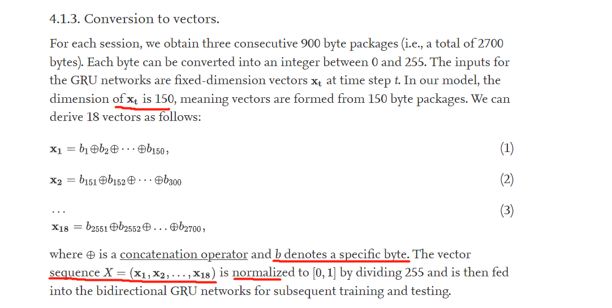
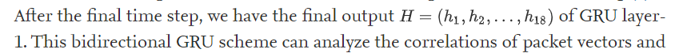
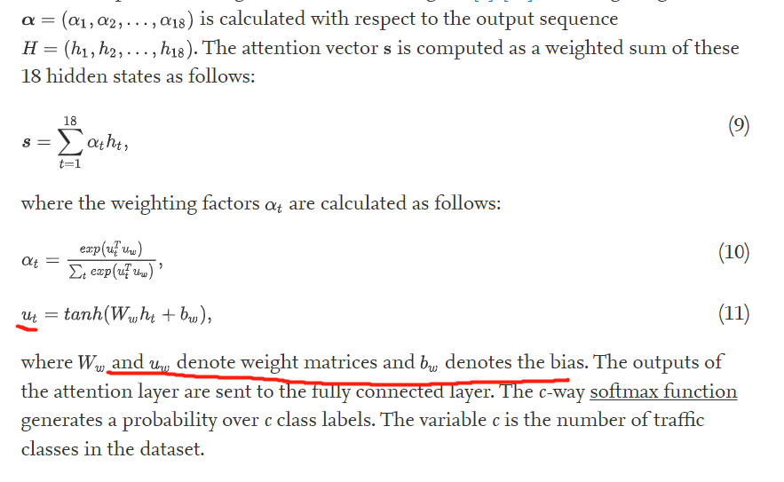

# attention-based LSTM

[Attention-based bidirectional GRU networks for efficient HTTPS traffic classification - ScienceDirect](https://www.sciencedirect.com/science/article/pii/S002002552030445X#b0170)

### 摘要

提出了一种称为BGRUA的新型深度学习模型，以准确识别运行在HTTPS连接上的web服务。BGRUA利用GRU和注意机制来提高HTTPS流量分类的准确性。双向GRU用于提取会话中字节序列的正向和反向特征。根据特征对分类的贡献，采用注意机制为特征分配权重

### 简介

基于会话的和基于数据包的

```
session-based, and packet-based research
```

基于会话的方法采用统计特征和传统机器学习算法（如C4.5）进行分类。它们的性能取决于特征选择[14]，这是一个复杂而耗时的过程。

通过训练而不是手动选择来学习特征，使用神经网络进行流量分类的基于数据包的方法。但是基于数据包方法的问题：流量数据很容易过时，在一个时间段内获得的数据在以后的时间段内可能不会遵循相同的分布；此外，没有一个流量数据集可以代表所有情况。

#### 论文的工作

我们提出了一种称为BGRUA的新方法，这是一种基于GRU网络和注意机制的HTTPS流量分类方法。BGRUA通过前向和后向GRU操作学习数据包的特征。它使用注意力机制为加密流量分类的有用特征分配更大的权重。为了提高不同数据集上模型训练的效率，我们将**转移学习**的概念引入到交通分类领域，对于新到达的流量，我们的模型只需调整全连接层即可实现快速模型收敛。总结：

- HTTPS数据包的字节序列对应于协议的特定字段，并包含丰富的独特特征。我们设计了一个双向GRU网络来自动从字节序列中学习深度信息，以便于分类。**传统的流量分类方法对所有特征赋予相同的权重，这不利于重要特征的提取。我们将双向GRU网络与注意力机制相结合，使我们的模型能够专注于有助于有效流量分类的有用特征。**

- 传统的分类模型只在特定的离线数据集上进行训练和评估，这意味着它们忽略了新流量。我们将转移学习的概念引入到加密流量分类中，根据真实网络环境中流量类型的多样性，可以基于当前知识对BGRUA进行训练，以实现快速收敛。

### https背景

### 加密流量分类的工作

#### 基于会话的方法（Session-based methods）

​       基于会话的方法需要手动提取会话特征。然后将这些特征用作分类器的输入。它们还用于训练分类算法，例如支持向量机（SVM）、C4.5或随机森林。Moore等人[17]讨论了249个基于会话和基于分组的特征，包括分组大小、分组间隔、会话中的分组数和会话持续时间。随后的流量分类工作主要集中在这249个特征的组合上

#### 基于数据包的方法（Packet-based methods）

基于分组的方法消除了手动特征选择的需要，并直接使用包的字节。预处理的数据包字节被送入深度学习模型中进行特征提取。

#### 迁移学习：略

​	总之，传统的基于会话的方法需要手动特征提取，这既耗时又低效。某些特征只能在会话结束时获得，例如会话持续时间和会话中的数据包总数，这使得此类方法不适用于实时分析。在现有的深度学习方法中，不同模型的参数数量非常大，计算复杂度很高。此外，现有模型没有考虑流量分布变化引起的性能下降。

​	考虑到现有方法的缺点，我们提出了一种新方法，该方法只需要会话中的前三个数据包来分类HTTPS流量，而不需要整个会话中的所有数据包。模型中的少量参数显著提高了分类速度。通过采用迁移学习的概念，我们的模型也可以在新收集的数据上快速收敛。

### 模型介绍

BGRUA的架构由四层组成：数据预处理层、双向GRU层、注意力层和转移学习层。


#### 数据预处理层

1. 从pcap拆分出流（源IP、目标IP、源端口、目标端口和传输层协议）

2. 包级特征：基于数据包的分类方法通常采用数据包有效载荷作为神经网络的输入。通常的做法是在会话中选择前P个数据包，其中每个数据包包含B字节。论文里P=3，B=900，我们从传输层开始提取数据包字节，然后在负载长度超过900时执行截断，在负载长度小于900时使用零填充。此外，我们通过将相应的字节替换为零来删除SNI扩展。这阻止了我们的网络**通过依赖SNI字段来学习特征**。

3. 对于每个会话，我们获得3个连续的900字节包，每个字节可以转换为0到255之间的整数，即一条流☞2700个值的向量

4. 将这2700维的向量拆分成18个向量，每个向量150维

   

#### 双向GRU层

递归网络由两层双向GRU层（即GRU-1和GRU-2）组成。如图3所示，每层由前向GRU和后向GRU组成。隐藏单元数设置为256

输出：对GRU-1，在最后，得到18个GRU cell输出的18个时间步各自的隐状态向量ht



将(h1,h2...h18)作为GRU-2的输入，

然后将GRU第二层的输出用作注意力层的输入。

```
关于LSTM的输出格式：https://blog.csdn.net/lsjmax/article/details/104376616
```

#### 注意力层

**并非所有数据包向量对HTTPS流量的分类都有同等的贡献。因此，应更加注意更有用的向量**。如图5所示，注意力层用于学习双向GRU-2在时间步长t处获得的每个隐藏状态的权重。因为总共有18个时间步长，根据输出序列计算加权向量。注意力向量s计算为这18个隐藏状态的加权和

注意力层的输出被发送到全连接层。c-way softmax函数生成c类标签上的概率。变量c是数据集中流量类的数量。



理解：

ht是一个词向量embedding

相比于原来的self-attention，这里的uw就相当于关键字向量k，但是这里的uw不是通过原来的embedding和一个大参数矩阵Wk相乘得到的，而是所有的emnedding共用这一个k，k本身就是一个待学习的权重向量。

ut就相当于self-attention的查询向量，只不过从embedding的生成方法是和一个大参数矩阵Ww相乘后又取tanh了。

总之得到ht和它对应的权重

#### 迁移学习层

HTTPS 流量很容易根据升级到协议版本或 Web 应用程序版本而过时。因此，一个时间段内的数据分布可能会在以后的时间段内发生变化。在从头开始训练模型既耗时又效率低下。因此，我们的迁移学习层旨在应用以前学到的知识来更快、更准确地解决新问题。

为了实现快速重建，转移学习层的结构仅重新训练全连接层的权重。

## 数据集

在这项研究中，我们考虑了两个基于会话的数据集和一个基于流的数据集。

### 与基线的比较

#### 5.2.1. CNN-LSTM 模型。

该模型是在[[33\]](https://www.sciencedirect.com/science/article/pii/S002002552030445X#b0165)中提出的。在此模型中，CNN 用于从单个数据包中提取特征，并训练 LSTM 以在流中的三个[连续数据包](https://www.sciencedirect.com/topics/computer-science/consecutive-packet)之间挑选时间序列特征。CNN-LSTM模型是当前最先进的加密流量分类深度学习模型。

#### 5.2.2. 多级随机森林法

[[8\]](https://www.sciencedirect.com/science/article/pii/S002002552030445X#b0040) 的作者定义了一个基于随机森林算法的分层结构来识别 HTTPS 服务。训练数据根据根域（例如“google.com”）和子域（例如“maps.google.com”）进行分组。对于每个分区，将训练一个细粒度[分类器](https://www.sciencedirect.com/topics/computer-science/classification-machine-learning)来区分服务。此方法是当前用于HTTPS流量分类的最新算法方法。

#### 5.2.3. 随机森林法。

为了验证[[8\]](https://www.sciencedirect.com/science/article/pii/S002002552030445X#b0040)中提出的分层结构的有效性，我们水平组织HTTPS域并使用随机森林算法进行训练。


