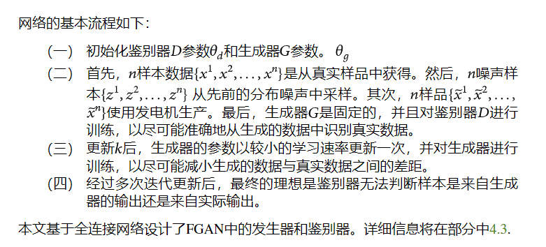

https://www.hindawi.com/journals/scn/2021/2713211/

# 论文简介

1. 没有采用特征工程而是payload，说了一堆特征工程的缺点

2. CBBI：一种基于Conv-BiLSTM的新型物联网设备识别方法，用于学习网络流量的时空特征

3. 数据增强模块FGAN，它解决了深度学习方法中的数据不平衡问题

4. 分类粒度：

   ```
   即使面对同一设备制造商生产的具有类似功能的物联网设备，CBBI也可以利用深度学习强大的特征学习能力，最终实现基于这些学习特征的物联网设备的准确识别
   ```

5. 数据集：UNSW-TMC2018在两周内生成的流量数据（因此非常少）和自有数据集

   在实验部分，我们选择了18个样本量相对较大的物联网设备

# 相关工作

被动：

Miettinen等人[23]提出了IoT Sentinel，从数据包中提取23个特征作为设备指纹，并使用两步分类方法识别设备。

郭和海德曼提出了一种分析DNS流量的方法，以检测物联网设备并识别其类型[24]

Sivanathan等人[27]使用统计属性，如设备流量活动周期、端口号、信令模式和密码套件作为设备的指纹特征。然后，他们使用多级机器学习分类算法来识别设备。

OWL[29]分析了无线局域网（WLAN）中的广播和多播数据包，基于从每个协议消息中提取的特征建立了多视图深度学习（MvWDL）模型，并对物联网设备进行分类。

本论文：载荷+GAN数据增强

主动：

冯等人[37]提出了一种基于获取规则的引擎（ARE），该引擎可以自动生成用于发现和注释物联网设备的规则，而无需任何训练数据。ARE使用来自物联网设备的应用层响应数据和相关网站中的产品描述来获取设备注释，从而构建设备规则。

总结：

基于分类模型的设备指纹识别方法主要利用设备通信流量中的一些字段值和相关统计特征，然后，结合机器学习或深度学习方法构建分类模型。基于主动检测的设备识别方法必须主动向网络中的目标设备发送大量检测数据包，这容易受到数据包丢失和网络延迟的影响。此外，探测数据包的频繁传输会增加网络负载。更重要的是，如果设备没有生成响应，或者如果响应包中没有有效信息，则无法进一步识别设备。

# 模型框架

数据预处理模块将物联网设备生成的原始网络流量转换为可用于深度学习模型的输入。此外，数据增强模块FGAN解决了深度学习中的数据不平衡问题。最后，Conv BiLSTM模块同时学习设备原始流量的时空特征，提高了模型的准确性和泛化能力。

## 数据预处理

从pcap生成流：SplitCap tool， 使用 SplitCap 工具将原始 pcap 文件转换为具有相同 5 元组的流

删除干扰字段：MAC地址和IP地址。在小型 LAN 中，设备数量有限，设备的 MAC 地址可以唯一标识设备，这些值在深度学习模型的特征提取过程中会占据比较大的权重，可能会影响模型的分类能力。因为是直接使用的payload所以将它们的值置零。

向量化：每个流的前10个数据包，每个数据包的前250字节

## 数据增强

FGAN



## Conv-BiLSTM网络模型


Conv-BiLSTM网络模型算法过程：

[Algorithm 2 | Identifying IoT Devices Based on Spatial and Temporal Features from Network Traffic (hindawi.com)](https://www.hindawi.com/journals/scn/2021/2713211/alg2/)

原始样本：一条流是一个10*250=2500个元素的向量

模型输入：50*50的方阵图片

模型配置见链接

CNN的输出被Reshape成batchSize\*10\*160的二维张量，也即一个句子有10个embedding，每个embedding160维。

CNN后每个样本的特征尺寸为1600。我们将 1600 维数据重塑为 10 ∗ 160 格式，并将其输入到 BiLSTM 中，其中 10 表示时间步长数。每个时间点的矢量维数为 160。BiLSTM由两层组成，每层有512个隐藏单元，每层使用sigmoid函数进行非线性操作。BiLSTM网络的最后一层采用全连接层，全连接层中的神经元数量等于物联网设备的数量。Softmax用作激活函数，它将多个神经元的输出映射到（0，1），并且每个输出的总和为1。可以为多个分类选择具有最大概率值的类型。

# 实验

## 数据集

新南威尔士大学数据集是物联网设备在两周内生成的流量数据（18个）+实验室环境中构建了一个物联网设备流量收集平台（23个）

数据集说明表：[Table 3 | Identifying IoT Devices Based on Spatial and Temporal Features from Network Traffic (hindawi.com)](https://www.hindawi.com/journals/scn/2021/2713211/tab3/)

## 实验参数

FGAN中的生成器和鉴别器都是基于多层感知器（MLP）实现的。具体信息显示在表格中[4](https://www.hindawi.com/journals/scn/2021/2713211/tab4/)和[5](https://www.hindawi.com/journals/scn/2021/2713211/tab5/).生成器的输入是一个 100 维高斯噪声向量，隐藏层包含 256、512、1024 和 2500 个神经元。鉴别器的输入既包含真实数据，也包含生成的数据，其维度为 2500。FGAN 中使用 LeakyReLU 激活函数、dropout 和 BatchNormalization 来优化模型。

FGAN模型参数：

https://www.hindawi.com/journals/scn/2021/2713211/tab4

https://www.hindawi.com/journals/scn/2021/2713211/tab5

Conv-BiLSTM模型参数：

[Table 6 | Identifying IoT Devices Based on Spatial and Temporal Features from Network Traffic (hindawi.com)](https://www.hindawi.com/journals/scn/2021/2713211/tab6/)

## 实验结果评价指标

 the recall, precision, accuracy, and F1-score

## 实验分析

### 消融实验

控制变量，就是在有或者没有某个模块下分别实验看该模块的作用。比如论文就是在有或者没有FGAN模块下的实验结果。

### 错误分类的分析

### 模型学习到的向量的t-SNE降维可视化

### 对比试验

CNN，FGAN + CNN，BiLSTM，FGAN + BiLSTM，CNN + BiLSTM等

UNSW-TMC2018是目前物联网设备识别相关工作的最高准确率，达到99.88%。但研究在 [27]使用了6个月的物联网设备通信流量数据。此外，作者基于手动提取的特征结合多级设备识别框架。

### 未来的工作

未知设备识别
